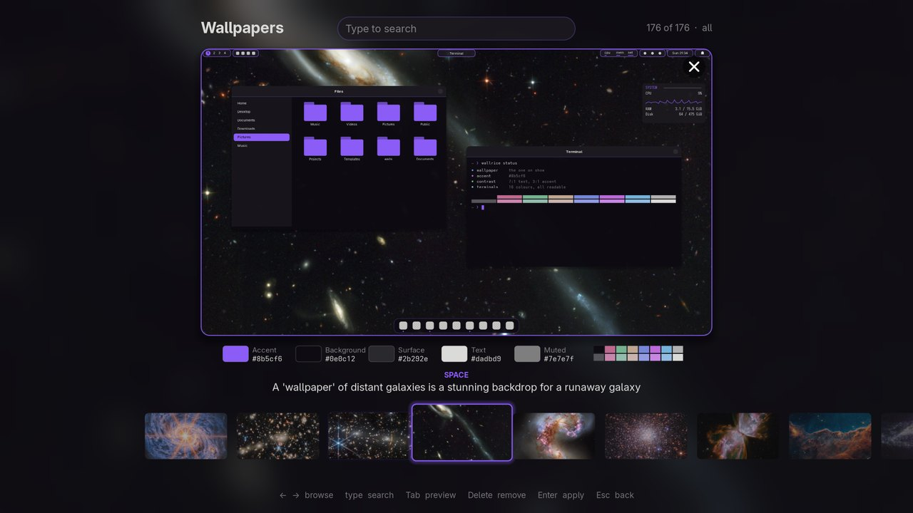
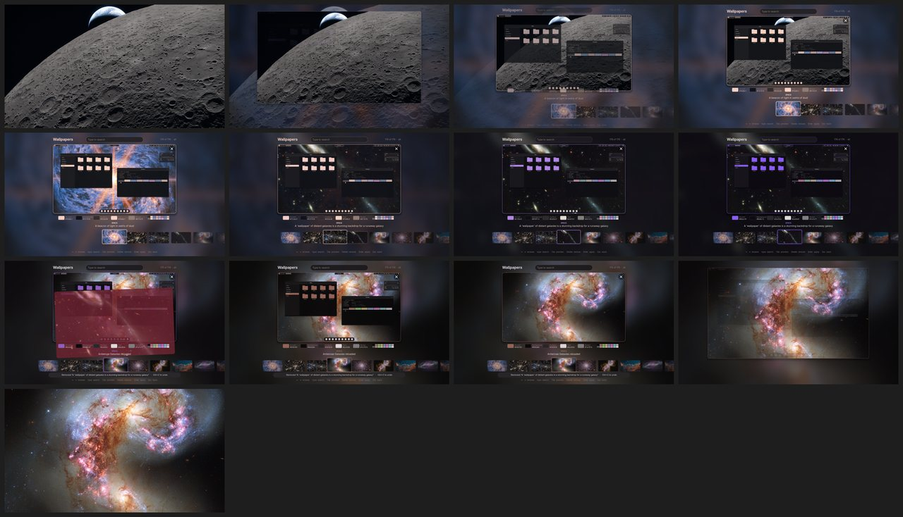
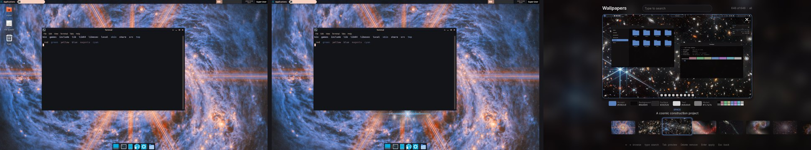
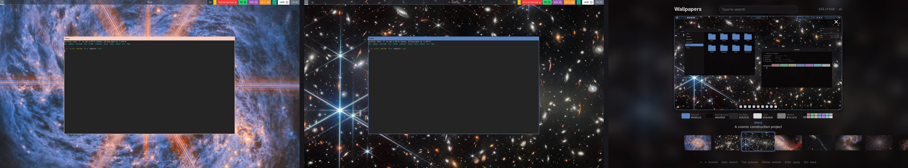
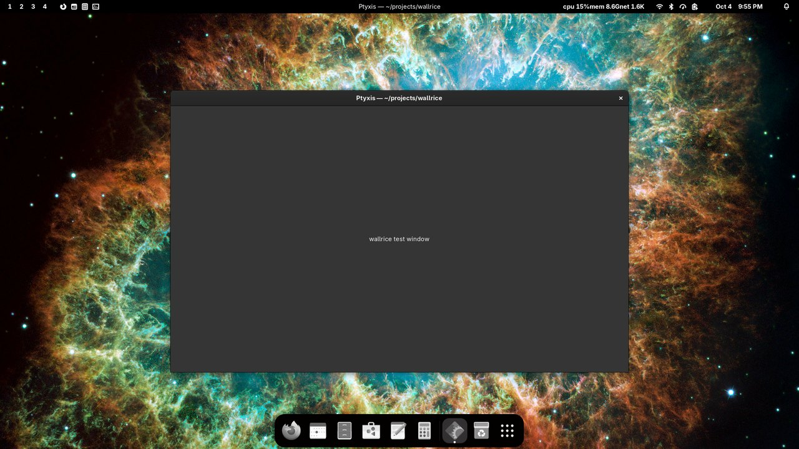
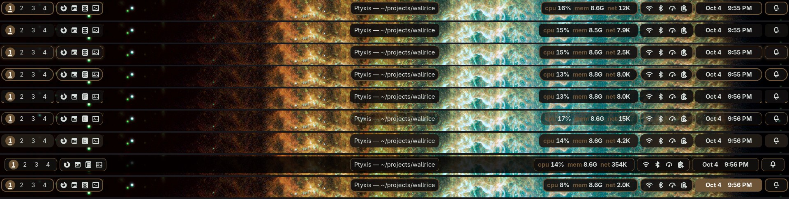
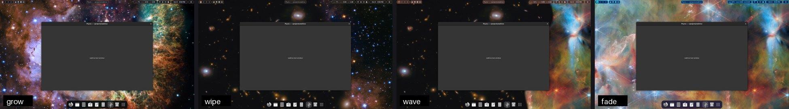
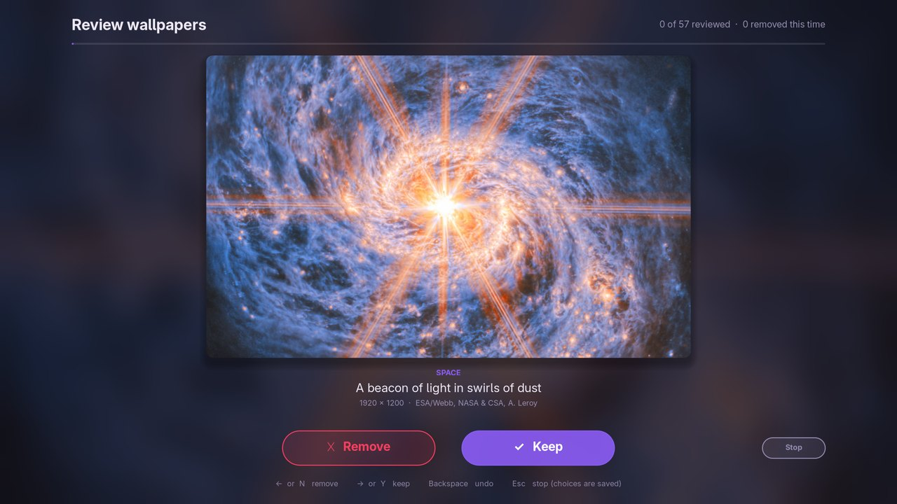

# wallrice

**The whole Linux desktop takes its colours from the wallpaper.** Pick a wallpaper and the bars,
windows, terminal, dock, accent and folder icons all follow, with text that stays readable on any
picture. A full-screen picker shows how the desktop will look before you apply it, wallpaper changes
are animated, and curated wallpaper collections (real ESA/Webb and ESA/Hubble space images first)
come with a Yes/No review. Pictures you remove stay gone.

wallrice is the portable successor of the [Chiron Stick](https://github.com/teterw/chiron-stick) desktop
theme. It installs per user, needs no root at run time, and detects the desktop it's running on.

> Status: **v0.5**. GNOME has everything (including a Shell extension for animated changes and the
> islands top bar); KDE Plasma, Xfce, Cinnamon, MATE, LXQt, wlroots compositors and X11 window
> managers have their own backends. See the [changelog](CHANGELOG.md).



## The picker

**Super+W** (or *Wallpapers* in the app menu) opens a full-screen preview screen. The current
wallpaper shrinks into a card over a blurred backdrop; browse with the arrow keys, the mouse wheel or
by clicking the filmstrip, and the card shows each picture with a mock of the themed desktop drawn
on it (bar, file manager, terminal with all 16 colours, dock) and the palette underneath, everything
recolouring smoothly. **Enter** grows the picture back to full screen while the theme is applied
underneath; **Esc** goes back. Type to search, **Tab** shows the bare picture, and **Delete** (or the
card's ✕) removes a wallpaper for good, with **Ctrl+Z** to undo.



## What follows the wallpaper

| Piece | How |
|---|---|
| GTK 3 apps | a generated theme (adw-gtk3-dark plus the wallpaper's colours) in two copies, switched live |
| GTK 4 / libadwaita apps | `~/.config/gtk-4.0/gtk.css`, plus the nearest named accent, live |
| Terminals | escape sequences recolour every open terminal; Ptyxis, kitty, alacritty, foot, wezterm and Konsole get colour files |
| Folder icons | a per-user Papirus overlay with folders in the accent's colour |
| Dock | Dash to Dock / Ubuntu Dock background and running dots |
| Other apps | btop, rofi, wofi, fuzzel and waybar colour files (`wallrice doctor` shows the line to include them) |

### Turning parts on and off

Every part of the theme can be switched off and on again, and the choice is saved: later wallpaper
changes (the picker, the timer, `random`) leave a part that's off alone, while the rest keeps
following the wallpaper. Off puts that part's original look back straight away (from the backup made
before wallrice first changed it); on themes it from the current wallpaper straight away.

```
wallrice parts                           what's on and off
wallrice off taskbar-icons terminal      e.g. colourful app icons again, and your terminal's own palette
wallrice on taskbar-icons                back to flat monochrome icons
wallrice off all  /  wallrice on all     everything at once (the wallpaper itself still changes)
```

| Part | What it is |
|---|---|
| `apps` | GTK and libadwaita app colours, and the accent colour |
| `icons` | folder icons in the accent colour |
| `terminal` | terminal colours (open terminals are reset when it goes off) |
| `dock` | the dock / taskbar in the theme's colours (GNOME) |
| `taskbar-icons` | flat monochrome app icons in the dock / taskbar and the top bar (GNOME) |
| `topbar` | the islands top bar; off gives GNOME's own bar back, live |
| `transitions` | animated wallpaper changes |
| `rotation` | a new wallpaper on a timer |

Colours are contrast-checked (WCAG): background always dark, text at 7:1 or more, accent at 3:1, muted
text and terminal colours at 4.5:1. Grey wallpapers get a violet accent (`#8b5cf6`). Palettes come
from [wallust](https://codeberg.org/explosion-mental/wallust) when it's installed, otherwise from a
built-in extractor, so it works on every distro.

## Desktops

| Desktop | Wallpaper | Live colours | Animated changes | Super+W |
|---|---|---|---|---|
| GNOME (Wayland), Budgie, Ubuntu | gsettings | GTK 3/4, Shell accent, icons, Ptyxis, dock, islands top bar | extension: grow, wipe, wave, fade | ✓ |
| KDE Plasma 5/6 | plasma-apply-wallpaperimage | A/B colour scheme with accent, icons, GTK apps | Plasma's fade | System Settings |
| Xfce | xfconf | GTK theme, icons, panel, xfce4-terminal | X11 overlay: grow, wipe, wave, fade | ✓ |
| Cinnamon, MATE | dconf | GTK theme, icons | X11 overlay | ✓ |
| LXQt | pcmanfm-qt | Qt palette, GTK settings, icons | X11 overlay (X11) | ✓ (next login) |
| Hyprland, Sway, river, … | swww / swaybg / hyprpaper | GTK theme, borders, waybar | swww: grow from the pointer, wipe, wave, fade | config line |
| i3, bspwm, Openbox, … | feh / xwallpaper / nitrogen | xsettingsd, borders | X11 overlay | config line |

Tested headless on GNOME 50 (the real Shell, `tools/shell-test.sh`) and in containers on Xfce 4.20,
Sway 1.11 and KDE Plasma 6 (`tools/desktop-test.sh`).





On a desktop wallrice doesn't support yet, it still writes the colour files and recolours open
terminals, and says what it couldn't do.

## Install

```sh
git clone https://github.com/teterw/wallrice
cd wallrice
./install.sh --dry-run   # see what it would do
./install.sh
```

The installer checks for Python 3.9+, Pillow, PyGObject with GTK 3, pycairo, git, Papirus and
adw-gtk3. It offers to install the missing ones with your package manager; sudo asks for your
password itself. Everything else goes into your home folder:

- the program: `~/.local/share/wallrice/` and `~/.local/bin/wallrice`;
- settings, state and review choices: `~/.config/wallrice/`;
- thumbnails and palettes: `~/.cache/wallrice/`;
- wallpapers: `~/Pictures/walls/`.

Before changing anything, wallrice saves the original of every setting and file it touches.
`./uninstall.sh` puts them all back, and keeps your wallpapers unless you type `yes`.

## Commands

```
wallrice apply IMAGE [--effect FX]  set the wallpaper (animated) and re-theme everything from it
wallrice pick                       full-screen picker with a live preview of the theme (Super+W)
wallrice random                     a random wallpaper (Shift+Super+W)
wallrice mode [all|calm]            every collection, or only calm ones (photos, space)
wallrice rotate off|MINUTES         change the wallpaper on a timer (default 30)
wallrice pause | resume             no rotation and no animations while the machine is busy
wallrice animations on|off          animated wallpaper changes
wallrice bar [STYLE|mono|colour]    top bar style with a live preview (GNOME); dock icon colours
wallrice parts                      every part of the theme, and whether it's on
wallrice off PART… | all            a part keeps (or gets back) its own look, saved
wallrice on PART… | all             it follows the wallpaper again
wallrice terminal [on|off]          the same as  wallrice on|off terminal
wallrice walls update [--background]  download or update the wallpaper collections
wallrice walls review               keep or remove each picture; removed ones stay gone
wallrice walls status               what's downloaded, kept and removed
wallrice walls import FILE          take Keep/Remove choices from another review.json (e.g. the stick's)
wallrice status                     current wallpaper and settings
wallrice doctor                     what was detected, which pieces are active, what's missing
```

The current colours are also in `~/.cache/wallrice/current.json` for your own scripts and bars.

## Wallpaper collections

`wallrice walls update` downloads these (about 1.4 GB; `--background` runs it detached with a log).
None are AI-generated.

| Collection | Pictures | Licence |
|---|---|---|
| ESA/Webb and ESA/Hubble top images (real telescope images, credit shown) | 57 | CC BY 4.0 |
| [elementary/wallpapers](https://github.com/elementary/wallpapers) (Unsplash photos) | 16 | see repo |
| [pop-os/wallpapers](https://github.com/pop-os/wallpapers) | 38 | see repo |
| [dracula/wallpaper](https://github.com/dracula/wallpaper) | 66 | MIT |
| [rose-pine/wallpapers](https://github.com/rose-pine/wallpapers) | 91 | CC0 |
| [D3Ext/aesthetic-wallpapers](https://github.com/D3Ext/aesthetic-wallpapers) | 378 | MIT |

## GNOME: the top bar, the dock and animated wallpaper changes



The wallrice GNOME Shell extension (installed with wallrice) adds what only the Shell can do:

- **Animated wallpaper changes** like swww: the new picture grows from the pointer, wipes or waves in,
  or fades, on the GPU, halfway through which the whole desktop recolours. The picker hands over
  seamlessly instead (its own zoom already animated the change).
- **An islands top bar**: workspaces 1-4, launchers, the window's title in the centre, cpu/mem/net
  (Vitals' own if you use it), volume/battery/wifi, the clock and a notification bell, each an island
  in the wallpaper's colours. **Nine styles** to choose from with `wallrice bar` (or *Top bar style* in
  the app menu); your real top bar changes as you move through them, Enter keeps one, Esc goes back.
- **The dock** (Dash to Dock or Ubuntu Dock) floats in the theme's colours, with flat monochrome
  icons (`wallrice bar colour` for colour icons).





GNOME only loads a newly installed extension at login, so log out and back in once after installing.
Turning the extension off in the Extensions app puts the stock top bar back; everything else keeps
working.

## The review

`wallrice walls review` (also in the app menu as *Review wallpapers*) shows every picture you haven't
kept yet, whole, with its collection, title, size and credit: **→ / Y keep, ← / N remove, Backspace
undo, Esc stop**. Every choice is saved at once and the review carries on where it stopped. Removed
pictures leave the disk when the review ends, and stay gone after updates. Holding a key never makes
more than one choice.



Git collections are partial clones with a sparse checkout, so only the picture folders download.
Space images are pinned by SHA-256: a file that doesn't match is skipped. wallrice never
redistributes the pictures. Folders of your own in `~/Pictures/walls/` join the library. To change
the list, copy `data/collections.conf` to `~/.config/wallrice/`.

## Development

```sh
python3 -m unittest discover -s tests   # needs Pillow; the UI tests also need GTK 3
ruff check .
bin/wallrice doctor                     # runs straight from the checkout
tools/shell-test.sh /tmp/shots          # the extension in a private headless GNOME Shell, with screenshots
tools/desktop-test.sh xfce /tmp/xfce    # another desktop headless in a throwaway container (xfce, sway, kde)
```

See [docs/design.md](docs/design.md) for how the pieces fit together.

## Licence

MIT. Parts are adapted from Chiron Stick's rice (MIT). Wallpapers belong to their authors and keep
their own licences.
