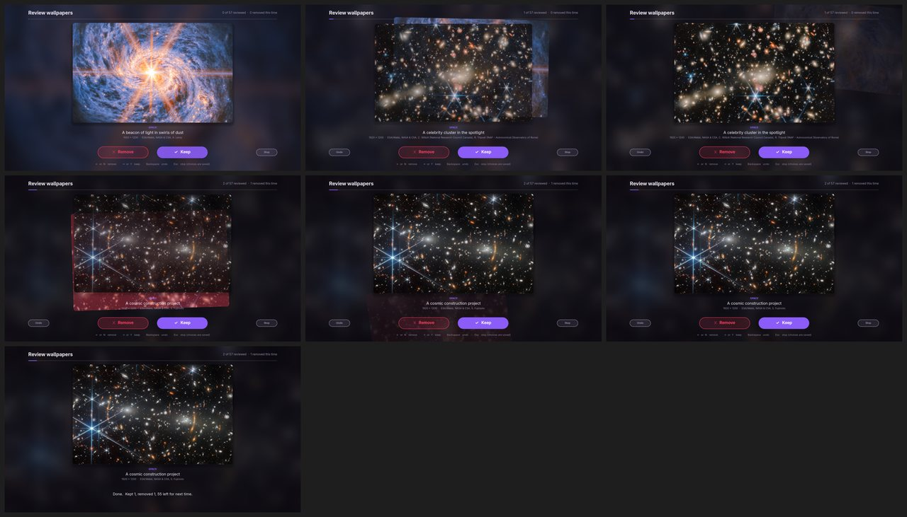

# wallrice

**The whole Linux desktop takes its colours from the wallpaper.** Pick a wallpaper and the bars,
windows, terminal, dock, accent and folder icons all follow, with text that stays readable on any
picture. A full-screen picker shows how the desktop will look before you apply it, wallpaper changes
are animated, and curated wallpaper collections (real ESA/Webb and ESA/Hubble space images first)
come with a Yes/No review. Pictures you remove stay gone.

wallrice is the portable successor of the [Chiron Stick](https://github.com/teterw/chiron-stick) desktop
theme. It installs per user, needs no root at run time, and detects the desktop it's running on.

> Status: **v0.2**. The theme engine, the GNOME backend, the collections and the Yes/No review work;
> the picker, the GNOME Shell extension and the other desktops are on the way (see the
> [changelog](CHANGELOG.md)).


## What follows the wallpaper

| Piece | How |
|---|---|
| GTK 3 apps | a generated theme (adw-gtk3-dark plus the wallpaper's colours) in two copies, switched live |
| GTK 4 / libadwaita apps | `~/.config/gtk-4.0/gtk.css`, plus the nearest named accent, live |
| Terminals | escape sequences recolour every open terminal; Ptyxis, kitty, alacritty, foot, wezterm and Konsole get colour files |
| Folder icons | a per-user Papirus overlay with folders in the accent's colour |
| Dock | Dash to Dock / Ubuntu Dock background and running dots |
| Other apps | btop, rofi, wofi, fuzzel and waybar colour files (`wallrice doctor` shows the line to include them) |

Colours are contrast-checked (WCAG): background always dark, text at 7:1 or more, accent at 3:1, muted
text and terminal colours at 4.5:1. Grey wallpapers get a violet accent (`#8b5cf6`). Palettes come
from [wallust](https://codeberg.org/explosion-mental/wallust) when it's installed, otherwise from a
built-in extractor, so it works on every distro.

## Desktops

| Desktop | Status |
|---|---|
| GNOME (Wayland, X11), Budgie, Ubuntu | ✓ v0.1 |
| KDE Plasma, Xfce, Cinnamon, MATE, LXQt | planned |
| Hyprland, Sway and other wlroots compositors | planned |
| X11 window managers (i3, bspwm, Openbox) | planned |

On a desktop wallrice doesn't support yet, it still writes the colour files and recolours open
terminals, and says what it couldn't do.

## Install

```sh
git clone https://github.com/teterw/wallrice
cd wallrice
./install.sh --dry-run   # see what it would do
./install.sh
```

The installer checks for Python 3.9+, Pillow, PyGObject with GTK 3, pycairo, git, Papirus and
adw-gtk3. It offers to install the missing ones with your package manager; sudo asks for your
password itself. Everything else goes into your home folder:

- the program: `~/.local/share/wallrice/` and `~/.local/bin/wallrice`;
- settings, state and review choices: `~/.config/wallrice/`;
- thumbnails and palettes: `~/.cache/wallrice/`;
- wallpapers: `~/Pictures/walls/`.

Before changing anything, wallrice saves the original of every setting and file it touches.
`./uninstall.sh` puts them all back, and keeps your wallpapers unless you type `yes`.

## Commands

```
wallrice apply IMAGE [--effect FX]  set the wallpaper (animated) and re-theme everything from it
wallrice pick                       full-screen picker with a live preview of the theme (Super+W)
wallrice random                     a random wallpaper (Shift+Super+W)
wallrice mode [all|calm]            every collection, or only calm ones (photos, space)
wallrice rotate off|MINUTES         change the wallpaper on a timer (default 30)
wallrice pause | resume             no rotation and no animations while the machine is busy
wallrice animations on|off          animated wallpaper changes
wallrice walls update [--background]  download or update the wallpaper collections
wallrice walls review               keep or remove each picture; removed ones stay gone
wallrice walls status               what's downloaded, kept and removed
wallrice status                     current wallpaper and settings
wallrice doctor                     what was detected, which pieces are active, what's missing
```

The current colours are also in `~/.cache/wallrice/current.json` for your own scripts and bars.

## Wallpaper collections

`wallrice walls update` downloads these (about 1.4 GB; `--background` runs it detached with a log).
None are AI-generated.

| Collection | Pictures | Licence |
|---|---|---|
| ESA/Webb and ESA/Hubble top images (real telescope images, credit shown) | 57 | CC BY 4.0 |
| [elementary/wallpapers](https://github.com/elementary/wallpapers) (Unsplash photos) | 16 | see repo |
| [pop-os/wallpapers](https://github.com/pop-os/wallpapers) | 38 | see repo |
| [dracula/wallpaper](https://github.com/dracula/wallpaper) | 66 | MIT |
| [rose-pine/wallpapers](https://github.com/rose-pine/wallpapers) | 91 | CC0 |
| [D3Ext/aesthetic-wallpapers](https://github.com/D3Ext/aesthetic-wallpapers) | 378 | MIT |

`wallrice walls review` (also in the app menu as *Review wallpapers*) shows every picture you haven't
kept yet, whole, with its collection, title, size and credit: **→ / Y keep, ← / N remove, Backspace
undo, Esc stop**. Every choice is saved at once and the review carries on where it stopped. Removed
pictures leave the disk when the review ends, and stay gone after updates. Holding a key never makes
more than one choice.



Git collections are partial clones with a sparse checkout, so only the picture folders download.
Space images are pinned by SHA-256: a file that doesn't match is skipped. wallrice never
redistributes the pictures. Folders of your own in `~/Pictures/walls/` join the library. To change
the list, copy `data/collections.conf` to `~/.config/wallrice/`.

## Development

```sh
python3 -m unittest discover -s tests   # needs Pillow; the UI tests also need GTK 3
ruff check .
bin/wallrice doctor                     # runs straight from the checkout
```

See [docs/design.md](docs/design.md) for how the pieces fit together.

## Licence

MIT. Parts are adapted from Chiron Stick's rice (MIT). Wallpapers belong to their authors and keep
their own licences.
